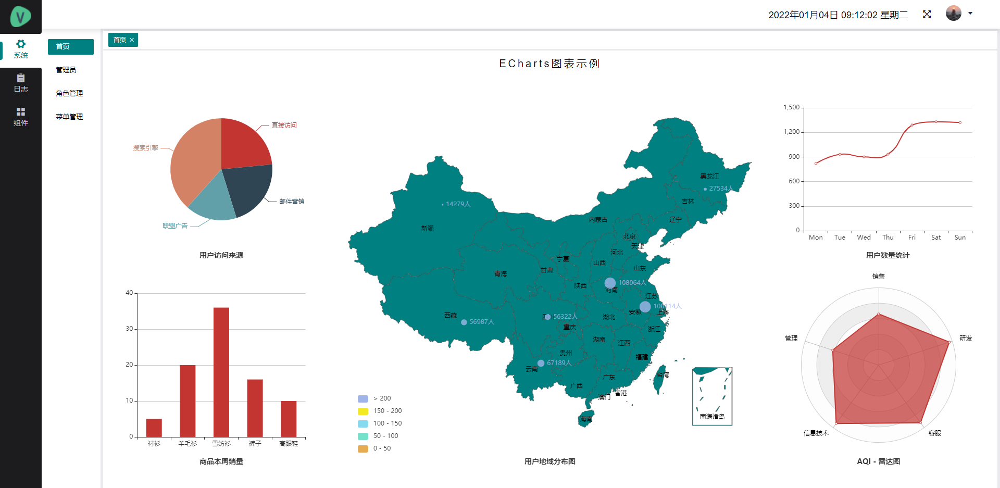
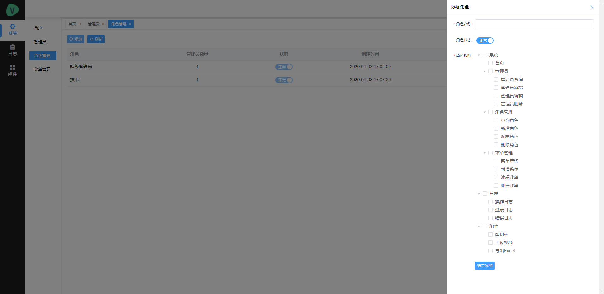
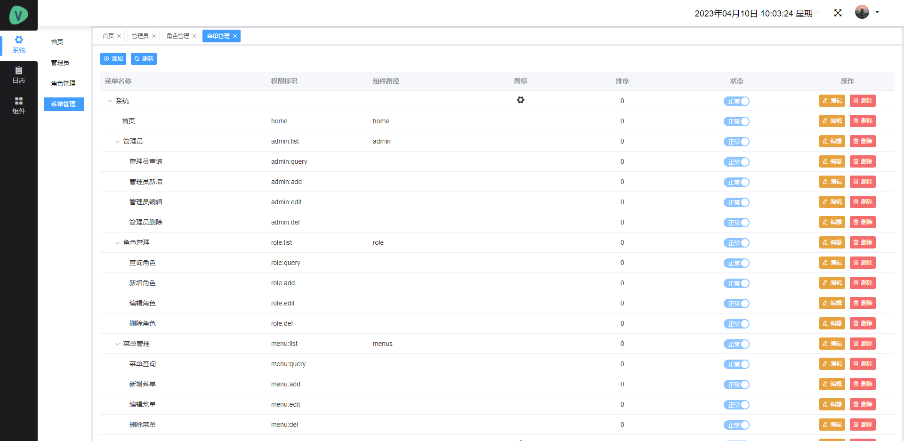
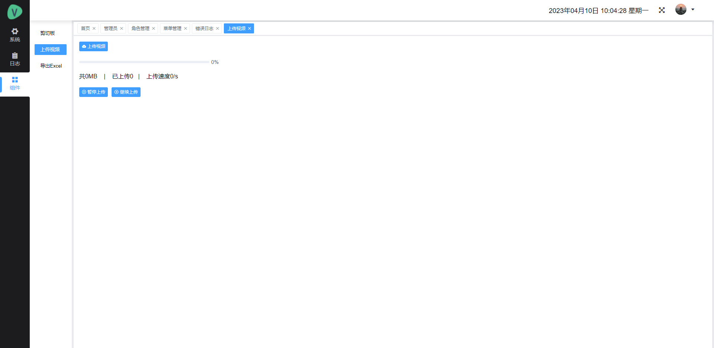

## SpringBoot-Admin 简称 spba
基于SpringBoot、Vue开发的通用后台管理系统，做到开箱即用，为新项目开发省去了基础功能开发的步骤。此系统主要包含：登录、注销、可视化数据大屏、管理员、角色管理、菜单管理、权限管理、错误日志、登录日志、操作日志、七牛云上传等功能。后端主要使用MySQL、MyBatis-Plus、Redis、Sa-Token权限认证框架、validation、七牛云等技术。拥有多线程配置类、定时任务、异步任务等示例。


## 项目截图









## 安装步骤
- git clone https://github.com/wdjisn/SpringBoot-Admin.git
- 使用maven引入依赖
- 将spba.sql文件导入数据库
- 修改application-dev.yml文件中mysql、redis配置项
- 获取客户端真实ip地址，需要配置nginx
	
	
## 目录结构
```
├── SpbaApiApplication 项目启动类
|
├── config 配置类
|
├── controller 控制器
|
|── dao 数据访问层

├── domain 实体类
│   ├── dto 数据传输对象
│   ├── entity 数据表对应实体
|
├── exception 异常处理
|
├── interceptor 拦截器
|
├── service 数据服务接口层
│   ├── impl 数据服务接口实现层
|
├── utils 工具类
|
├── resources
|   ├── mapper SQL对应的XML文件
```


## 前端代码仓库
- https://github.com/wdjisn/SpringBoot-Vue.git


## 在线体验
- 网址：http://spba.baobaonames.cn/#/login
- 账号：style
- 密码：admin123


## 疑问解答
- 微信：wdjisn